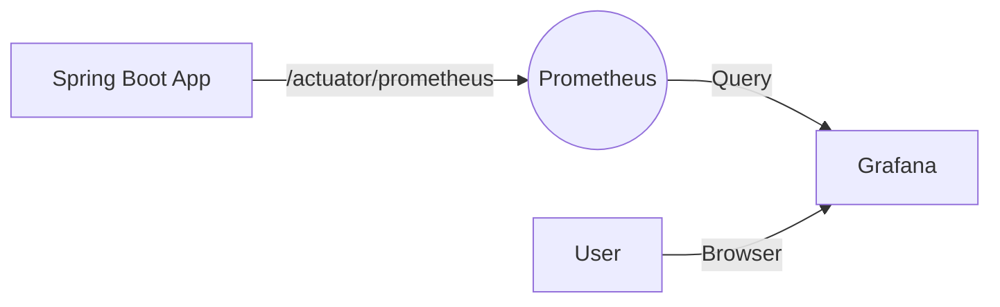

# 📊 Spring Boot Observability com Prometheus e Grafana

Este projeto é uma implementação prática de **Observabilidade** em uma aplicação Java Spring Boot. Ele demonstra como expor métricas, coletá-las e visualizá-las utilizando o padrão de mercado atual.

## 🖼️ Visão Geral da Arquitetura

O fluxo de monitoramento implementado segue a arquitetura *pull-based* do Prometheus:

1.  **Spring Boot Actuator + Micrometer:** Expõe os dados da aplicação.
2.  **Prometheus:** Coleta (scrape) as métricas a cada 15 segundos.
3.  **Grafana:** Consulta o Prometheus para gerar gráficos visuais.

